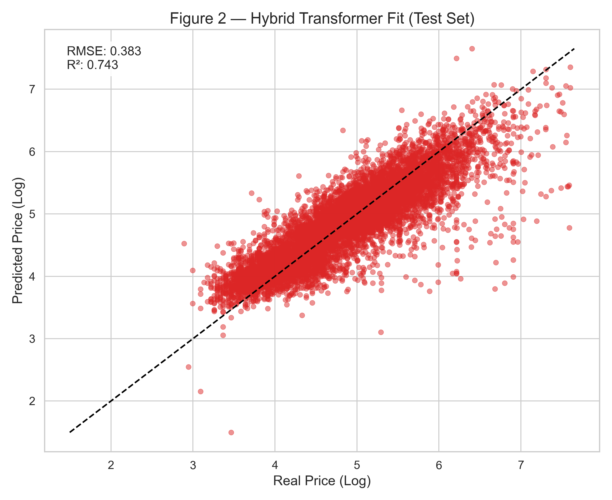
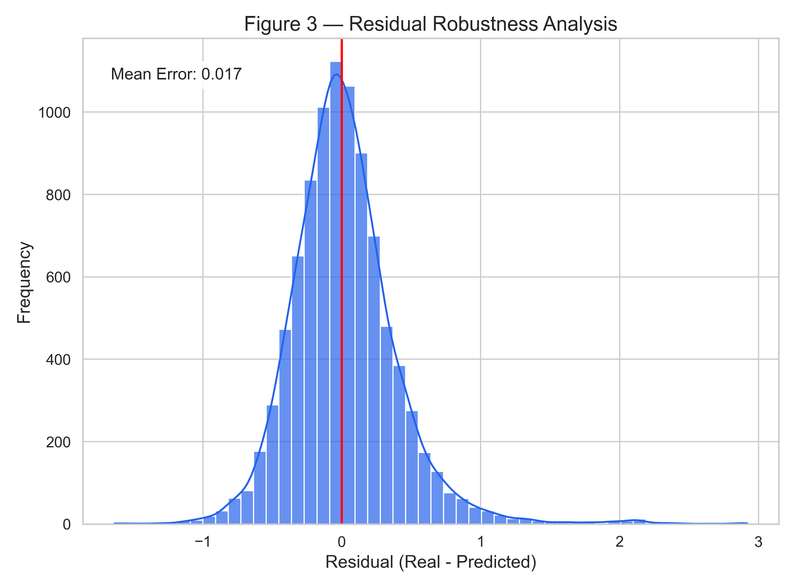
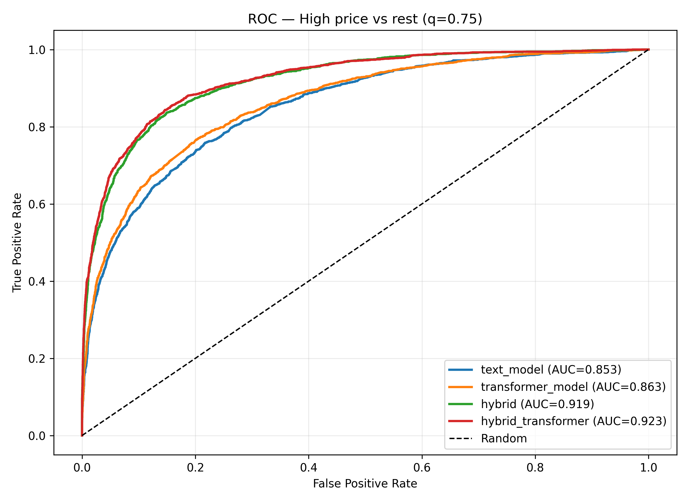

# Predicting Airbnb Listing Prices with Deep Learning


> **Research question:** Can Natural Language Processing on listing descriptions
> improve Airbnb price predictions compared to tabular features alone?

## Overview

This project builds and compares seven models across five families for
predicting the **log-price** of Airbnb listings in London:

| Model                  | Features                                    | Architecture                             |
| ---------------------- | ------------------------------------------- | ---------------------------------------- |
| **OLS Baseline**       | Tabular (numeric + spatial + categorical)   | Linear Regression (scikit-learn)         |
| **Random Forest**      | Tabular (numeric + spatial + categorical)   | Random Forest (scikit-learn)             |
| **TF-IDF + Ridge**     | Text (description + neighbourhood overview) | TF-IDF → Ridge Regression (scikit-learn) |
| **Text Model**         | Text (description + neighbourhood overview) | Embedding → LSTM → Linear head (PyTorch) |
| **Transformer**        | Text (description + neighbourhood overview) | Embedding → Transformer Encoder → Linear |
| **Hybrid LSTM**        | Tabular + Text                              | MLP + LSTM → Late fusion (PyTorch)       |
| **Hybrid Transformer** | Tabular + Text                              | Transformer Encoder + MLP → Late fusion  |

Data is sourced from [Inside Airbnb](http://insideairbnb.com/) and includes
61,406 cleaned London listings after preprocessing.

Tabular features include numeric attributes (accommodates, bathrooms, bedrooms, beds),
engineered spatial features (Haversine distance to London centre, latitude and longitude
offsets), and one-hot encoded room type. Train/validation/test splits are stratified by
price quantile and room type to ensure representative evaluation across all segments.

The checked-in outputs in this refresh were regenerated from the latest
London snapshot available during the rerun: **2025-09-14**. That pipeline
run loaded **96,871** raw listings and produced **42,984 train**,
**9,211 validation**, and **9,211 test** rows after cleaning and splitting.

## What's New In This Version

- Added a `TF-IDF + Ridge` text baseline alongside OLS and Random Forest.
- Upgraded tabular processing with spatial feature engineering and categorical one-hot encoding.
- Improved deep-model training with `AdamW`, weight decay, LR scheduling, gradient clipping, and faster dataloaders.
- Refactored Transformer positional encoding into a shared `src/models/layers.py` module.
- Fixed interpretability artifact generation for lexical high/low-price signals and hybrid-model vocabulary loading.
- Synced this README to the refreshed benchmark, regenerated figures, and current saved outputs.

## Project Structure

```
src/
├── config.py              # Centralised constants & hyperparameters
├── pipeline/              # Data collection, cleaning, splitting
├── features/              # Text & tabular feature engineering
├── models/                # PyTorch model architectures
│   └── layers.py          # Shared components (positional encoding)
├── training/              # Training scripts (CLI entry points)
└── visualization/         # Plot generation + interpretability
```

## Installation

Requires **Python >= 3.11**.

```bash
git clone https://github.com/emschutt/Applied-Data-Science-Classes.git
cd "Applied-Data-Science-Classes/Deep Learning/final project"
```

**With [uv](https://docs.astral.sh/uv/)** (recommended):

```bash
uv sync
```

**With pip:**

```bash
python -m venv .venv && source .venv/bin/activate
pip install -r requirements.txt
```

## Reproducing the Results

Run the steps below **in order**. All hyperparameters are configured
in `src/config.py` — the CLI commands can stay minimal.

> Replace `uv run` with `python` if you use a regular virtualenv.
> All training scripts resume from saved checkpoints by default.
> Add `--no-resume` when you want a clean rerun from scratch.
> Because `main.py` downloads the latest available London export, exact
> metrics can shift over time as the underlying snapshot changes.

### 1. Data Collection & Cleaning

Downloads the latest London listings from Inside Airbnb, cleans the data
and creates stratified train / validation / test splits (70 / 15 / 15):

```bash
uv run python main.py
```

### 2. Tabular & Text Baselines

Trains OLS, Random Forest, and TF-IDF + Ridge baselines:

```bash
uv run python src/training/train_baseline.py
```

### 3. Text Model (LSTM)

Trains a text-only LSTM on listing descriptions:

```bash
uv run python src/training/train_text_model.py --use-neighborhood-overview --no-resume
```

### 4. Transformer Model (Encoder-only)

Trains a Transformer encoder model (attention-based) on text:

```bash
uv run python src/training/train_transformer_model.py --use-neighborhood-overview --no-resume
```

### 5. Hybrid Model (Text + Tabular)

Trains the LSTM fusion model combining text and tabular features:

```bash
uv run python src/training/train_hybrid_model.py --use-neighborhood-overview --no-resume
```

### 6. Hybrid Transformer Model (Text + Tabular)

Trains the hybrid Transformer + tabular model:

```bash
uv run python src/training/train_hybrid_transformer.py --use-neighborhood-overview --no-resume
```

### 7. Interpretability (Post-training)

Runs residual and lexical analysis without retraining, and exports insights:

```bash
uv run python src/visualization/interpretability.py
```

### 8. Poster Figures (Publication-ready)

Generates high-resolution (300 DPI) figures for the final poster:

```bash
uv run python src/visualization/poster_plots.py --use-neighborhood-overview
```

## Results

### Quantitative Benchmark (Test Set, London 2025-09-14 Snapshot)

| Model                               |       RMSE |        MAE |         R² |
| ----------------------------------- | ---------: | ---------: | ---------: |
| OLS (baseline)                      |     0.5072 |     0.3829 |     0.5496 |
| Random Forest                       |     0.4032 |     0.2913 |     0.7153 |
| TF-IDF + Ridge (text only)          |     0.5140 |     0.3861 |     0.5375 |
| LSTM (text only)                    |     0.5259 |     0.3895 |     0.5157 |
| Transformer (text only)             |     0.5122 |     0.3766 |     0.5406 |
| Hybrid LSTM (text + tabular)        |     0.4000 |     0.2918 |     0.7199 |
| **Hybrid Transformer (text + tabular)** | **0.3829** | **0.2758** | **0.7433** |

The **Hybrid Transformer** is the strongest model overall, surpassing both
the Random Forest baseline and all other deep learning models. Adding text
features to tabular inputs consistently improves performance, and the
attention-based fusion architecture achieves the best results.

### Visual Results

The figures below are the current regenerated outputs saved under
`data/results/london/plots/`.


_Figure 1 — R² comparison across all model families._


_Figure 2 — Predicted vs actual log-price for the Hybrid Transformer._


_Figure 3 — Residual distribution for robustness analysis._


_Figure 4 — ROC comparison across models for high-price classification (quantile threshold)._

### Key Findings

- Text alone (LSTM, Transformer, TF-IDF) roughly matches OLS but cannot compete with Random Forest, confirming that structured features carry strong signal for pricing.
- Fusion is decisive: both hybrid models surpass the Random Forest baseline, demonstrating that text descriptions contain pricing signal that tabular features alone miss.
- The Hybrid Transformer (R² = 0.743) is the best overall model, outperforming Random Forest (R² = 0.715) by a meaningful margin.
- Room type is the single most important feature in the Random Forest (42% importance), followed by spatial location (latitude + longitude together ~35%).
- Regenerated interpretability exports now align corrected high-price and low-price word signals with the saved model artifacts.
- Current experiments are London-only; cross-city generalization remains future work.

## Future Work

- Cross-city generalization (Paris, NYC, Berlin).
- Fine-tuned BERT encoder instead of custom embeddings.
- Neighbourhood-level price heatmaps and richer geospatial features.

## Output Files

All metrics and artifacts are saved to `data/results/london/`:

| File                                   | Content                                  |
| -------------------------------------- | ---------------------------------------- |
| `baseline_metrics.json`                | OLS, RF & TF-IDF + Ridge test metrics    |
| `text_model/test_metrics.json`         | LSTM test metrics                        |
| `transformer_model/test_metrics.json`  | Transformer test metrics                 |
| `hybrid/test_metrics.json`             | Hybrid LSTM test metrics                 |
| `hybrid_transformer/test_metrics.json` | Hybrid Transformer test metrics          |
| `comparison_chart.png`                 | R² bar chart across all models           |
| `hybrid/vocab.json`                    | Hybrid-model vocabulary export           |

Poster figures are saved in `data/results/london/plots/`:

| File                                    | Content                                              |
| --------------------------------------- | ---------------------------------------------------- |
| `figure_1_methodological_benchmark.png` | Benchmark bar chart (all model families)             |
| `figure_2_best_model_fit.png`           | Scatter plot: real vs predicted (Hybrid Transformer) |
| `figure_3_residual_robustness.png`      | Residual histogram + KDE robustness analysis         |
| `roc_curve.png`                         | ROC comparison for high-price classification         |

Interpretability outputs are saved in `data/results/london/interpretability/`:

| File                                      | Content                                                                 |
| ----------------------------------------- | ----------------------------------------------------------------------- |
| `test_residuals_all_models.csv`           | Residuals and errors for all available deep models                      |
| `test_residuals.csv`                      | Compatibility alias of the multi-model residual export                  |
| `model_metrics_summary.csv`               | Per-model RMSE/MAE/R² summary on the test set                           |
| `top_best_model_vs_baseline_listings.csv` | Listings ranked by the saved best-model improvement proxy vs baseline |
| `top_words_high_price.csv`                | Top lexical markers associated with expensive listings                  |
| `top_words_low_price.csv`                 | Top lexical markers associated with cheaper listings                    |
| `word_price_signals.png`                  | Bar chart of high-price vs low-price lexical signals                    |
| `interpretability_summary.json`           | Global summary (models evaluated, best model, lexical outputs)          |
