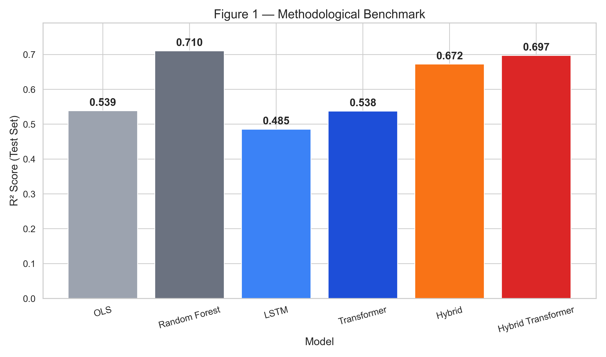

# Predicting Airbnb Listing Prices with Deep Learning


> **Research question:** Can Natural Language Processing on listing descriptions
> improve Airbnb price predictions compared to tabular features alone?

## Overview

This project builds and compares six models across four families for
predicting the **log-price** of Airbnb listings in London:

| Model                  | Features                                    | Architecture                             |
| ---------------------- | ------------------------------------------- | ---------------------------------------- |
| **Baseline**           | Tabular (numeric + categorical)             | OLS & Random Forest (scikit-learn)       |
| **Text Model**         | Text (description + neighbourhood overview) | Embedding → LSTM → Linear head (PyTorch) |
| **Hybrid**             | Tabular + Text                              | MLP + LSTM → Late fusion (PyTorch)       |
| **Transformer**        | Text (description + neighbourhood overview) | Embedding → Transformer Encoder → Linear |
| **Hybrid Transformer** | Tabular + Text                              | Transformer Encoder + MLP → Late fusion  |

Data is sourced from [Inside Airbnb](http://insideairbnb.com/) and includes
61,406 cleaned London listings after preprocessing.

## Project Structure

```
src/
├── config.py              # Centralised constants & hyperparameters
├── pipeline/              # Data collection, cleaning, splitting
├── features/              # Text & tabular feature engineering
├── models/                # PyTorch model architectures
├── training/              # Training scripts (CLI entry points)
└── visualization/         # Plot generation + interpretability
```

## Installation

Requires **Python ≥ 3.11**.

```bash
git clone https://github.com/ethanbch/deep-learning-airbnb.git
cd deep-learning-airbnb
```

**With [uv](https://docs.astral.sh/uv/)** (recommended):

```bash
uv sync
```

**With pip:**

```bash
python -m venv .venv && source .venv/bin/activate
pip install -r requirements.txt
```

## Reproducing the Results

Run the seven steps below **in order**. All hyperparameters are configured
in `src/config.py` — the CLI commands can stay minimal.

> Replace `uv run` with `python` if you use a regular virtualenv.

### 1. Data Collection & Cleaning

Downloads the latest London listings from Inside Airbnb, cleans the data
and creates train / validation / test splits (70 / 15 / 15):

```bash
uv run python main.py
```

### 2. Tabular Baseline

Trains OLS and Random Forest on numeric + categorical features only:

```bash
uv run python src/training/train_baseline.py
```

### 3. Text Model (LSTM)

Trains a text-only LSTM on listing descriptions:

```bash
uv run python src/training/train_text_model.py --use-neighborhood-overview
```

### 4. Hybrid Model (Text + Tabular)

Trains the fusion model combining both modalities and generates
a comparison chart (`data/results/london/comparison_chart.png`):

```bash
uv run python src/training/train_hybrid_model.py --use-neighborhood-overview
```

### 5. Transformer Model (Encoder-only)

Trains a basic Transformer encoder model (attention-based) on text:

```bash
uv run python src/training/train_transformer_model.py --use-neighborhood-overview
```

### 6. Hybrid Transformer Model (Text + Tabular)

Trains the hybrid Transformer + tabular model and saves artifacts under
`data/results/london/hybrid_transformer/`:

```bash
uv run python src/training/train_hybrid_transformer.py --use-neighborhood-overview
```

### 7. Interpretability (Post-training)

Runs residual and lexical analysis without retraining, and exports insights:

```bash
uv run python src/visualization/interpretability.py
```

### 8. Poster Figures (Publication-ready)

Generates three high-resolution (300 DPI) figures for the final poster:

```bash
uv run python src/visualization/poster_plots.py --use-neighborhood-overview
```

## Results

### Quantitative Benchmark (Test Set)

| Model                               |       RMSE |        MAE |         R² |
| ----------------------------------- | ---------: | ---------: | ---------: |
| OLS (baseline)                      |     0.5144 |     0.3889 |     0.5387 |
| Random Forest                       | **0.4076** | **0.2931** | **0.7104** |
| LSTM (text only)                    |     0.5433 |     0.3981 |     0.4854 |
| Hybrid LSTM (text + tabular)        |     0.4335 |     0.3186 |     0.6723 |
| Transformer (text only)             |     0.5151 |     0.3783 |     0.5375 |
| Hybrid Transformer (text + tabular) |     0.4167 |     0.3088 |     0.6972 |

Random Forest is the strongest overall model on this dataset, while the
Hybrid Transformer is the strongest deep-learning model.

### Visual Results


_Figure 1 — R² comparison across all model families._


_Figure 2 — Predicted vs actual log-price for the Hybrid Transformer._


_Figure 3 — Residual distribution for robustness analysis._


_Figure 4 — ROC comparison across models for high-price classification (quantile threshold)._

### Key Findings

- Text alone is weaker than strong tabular baselines on this dataset.
- Fusion helps: combining text and tabular features yields large gains over text-only models.
- Attention-based fusion (Hybrid Transformer) outperforms the LSTM-based hybrid.
- Lexical interpretability highlights clear high-price and low-price word signals.
- Current experiments are London-only; cross-city generalization remains future work.

## Future Work

- Cross-city generalization (Paris, NYC, Berlin).
- Fine-tuned BERT encoder instead of custom embeddings.
- Richer geospatial features (neighbourhood-level price heatmaps).

All metrics and artifacts are saved to `data/results/london/`:

| File                                   | Content                         |
| -------------------------------------- | ------------------------------- |
| `baseline_metrics.json`                | OLS & RF test metrics           |
| `text_model/test_metrics.json`         | LSTM test metrics               |
| `hybrid/test_metrics.json`             | Hybrid test metrics             |
| `transformer_model/test_metrics.json`  | Transformer test metrics        |
| `hybrid_transformer/test_metrics.json` | Hybrid Transformer test metrics |
| `comparison_chart.png`                 | R² bar chart across all models  |

Poster figures are saved in `data/results/london/plots/`:

| File                                    | Content                                              |
| --------------------------------------- | ---------------------------------------------------- |
| `figure_1_methodological_benchmark.png` | Benchmark bar chart (all model families)             |
| `figure_2_best_model_fit.png`           | Scatter plot: real vs predicted (Hybrid Transformer) |
| `figure_3_residual_robustness.png`      | Residual histogram + KDE robustness analysis         |
| `roc_curve.png`                         | ROC comparison for high-price classification         |

Interpretability outputs are saved in `data/results/london/interpretability/`:

| File                                      | Content                                                                 |
| ----------------------------------------- | ----------------------------------------------------------------------- |
| `test_residuals_all_models.csv`           | Residuals and errors for all available deep models                      |
| `test_residuals.csv`                      | Compatibility alias of the multi-model residual export                  |
| `model_metrics_summary.csv`               | Per-model RMSE/MAE/R² summary on the test set                           |
| `top_best_model_vs_baseline_listings.csv` | Listings where the best deep model has strongest gain proxy vs baseline |
| `top_words_high_price.csv`                | Top lexical markers associated with expensive listings                  |
| `top_words_low_price.csv`                 | Top lexical markers associated with cheaper listings                    |
| `word_price_signals.png`                  | Bar chart of high-price vs low-price lexical signals                    |
| `interpretability_summary.json`           | Global summary (models evaluated, best model, lexical outputs)          |
